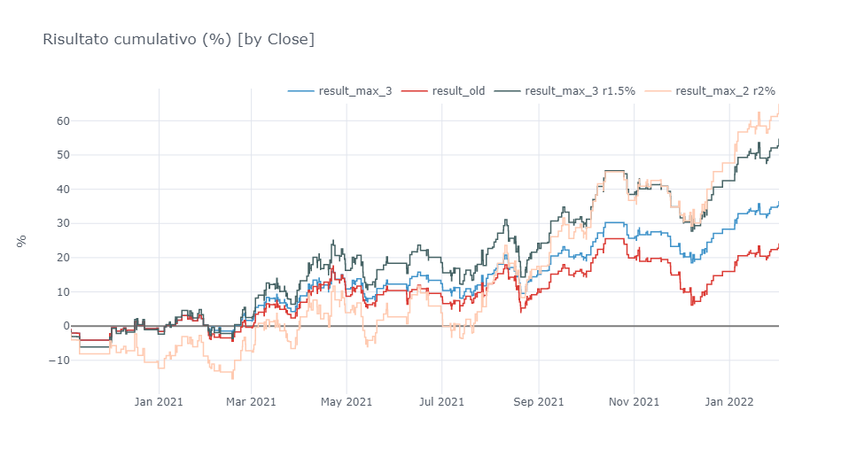
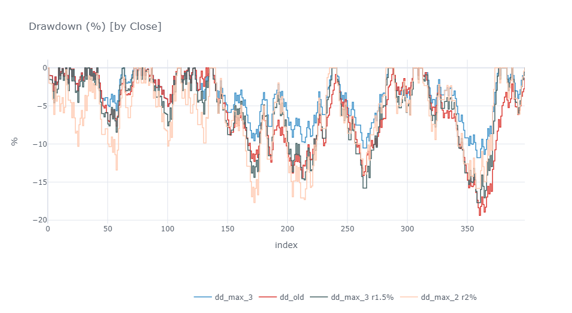
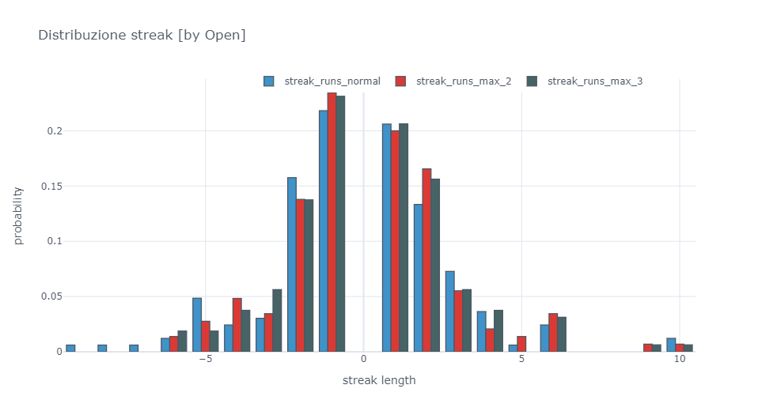

# Signals Backtesting Results

This repository contains the results of the analysis of different trading signals providers (for now it's just one), made with the **SignalBacktester** package (private repo).

These analysis aim to determine whether the signals are fit to pass [Prop Firm Challenges](https://www.investopedia.com/terms/p/proprietarytrading.asp) which usually share the same requirements and targets.

These metrics are taken into consideration:
- Overall cumulative results
- Monthly cumulative results
- Total drawdown
- Daily drawdown
- Trading frequency
- Custom "Challenge Pass" metric
- And more...

You can check out the notebook [here](https://nbviewer.org/github/965311532/backtesting-results/blob/master/backtesting-results.ipynb?flush-cache=True).

## Screenshots
These are some example screenshots from the analysis:

